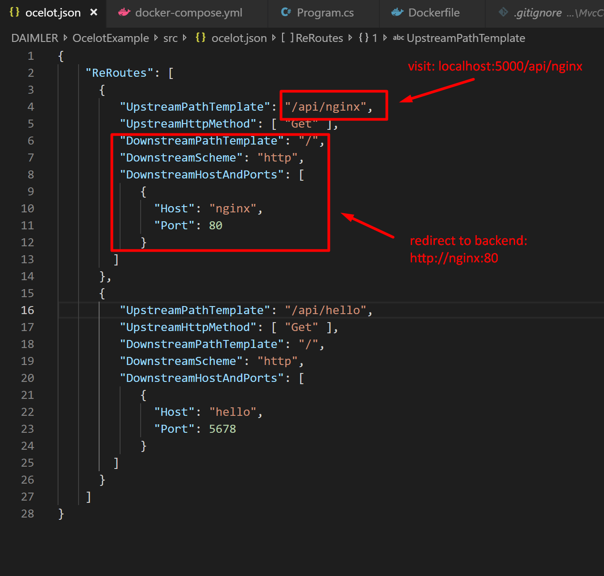
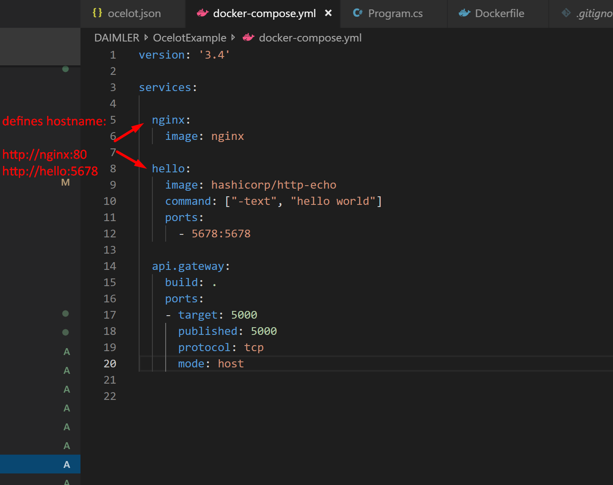

# Ocelot Example

```
docker-compose build
docker-compose up

1) visit: http://localhost:5000/api/nginx
2) visit: http://localhost:5000/api/hello
```

# How To Configure Ocelot



# Docker Compose Example



